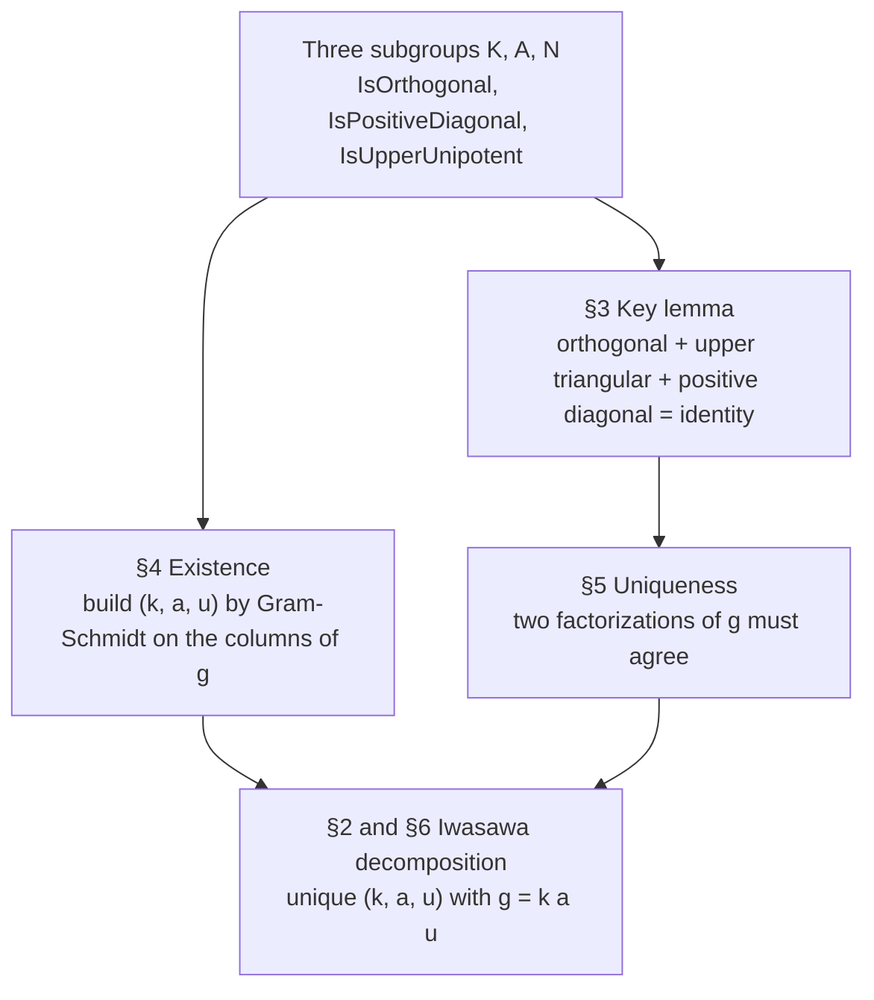
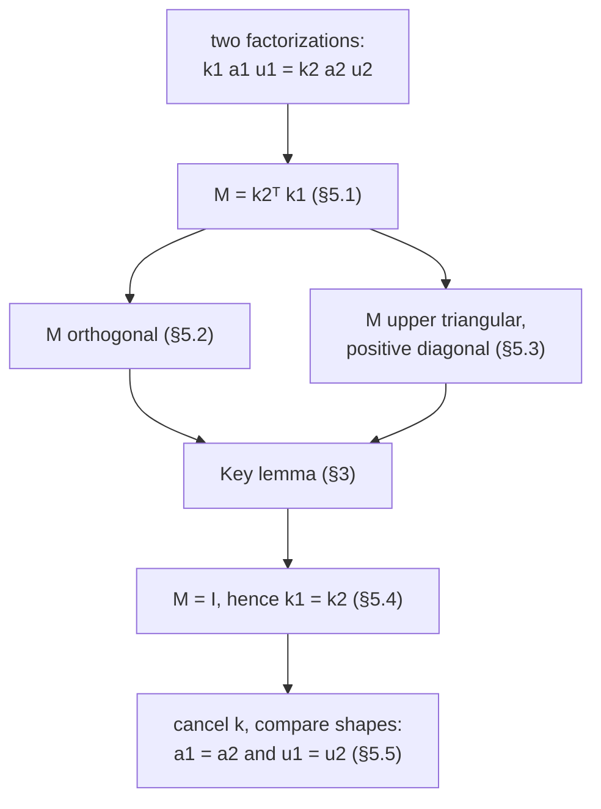

# The Iwasawa Decomposition of $GL_n(\mathbb{R})$

[](https://github.com/CuteSurtr/Iwasawa_Decomposition/actions/workflows/build.yml)

This document records a complete proof of the Iwasawa decomposition
for the real general linear group $GL_n(\mathbb{R})$: every invertible
$n \times n$ real matrix factors uniquely as the product of an
orthogonal matrix, a positive diagonal matrix, and an upper-triangular
matrix with ones on the diagonal. The proof follows the one given by
Lang in *Linear Algebra* (3rd edition, 1987, Appendix II).

Every step is formalized and verified by machine in the companion
Lean 4 file [`Iwasawa.lean`](Iwasawa.lean); the section numbers below
match the `§` markers in that file (see
[Formalization in Lean](#formalization-in-lean) at the end).

As of the pinned Mathlib version, this decomposition is not in Mathlib (the
only `Iwasawa` entries there are an unrelated group simplicity criterion and a
TODO for `Iwasawa matrices`), so the formalization fills a genuine gap, built
on Mathlib's `gramSchmidt` API.

The exposition is organized into six sections:

1. Notation and the three subgroups involved.
2. The statement of the theorem.
3. The key lemma on which the uniqueness argument turns.
4. The existence proof, by Gram-Schmidt orthonormalization of the
   columns of the matrix.
5. The uniqueness proof, by reduction to the key lemma.
6. A short conclusion summarizing the result.

The diagram below shows how the pieces fit together: the three
subgroups support both halves of the argument, the key lemma drives
uniqueness, and existence together with uniqueness give the theorem.



---

## 1. Notation

Let $M_n(\mathbb{R})$ denote the set of all $n \times n$ matrices
with real entries. Write $I$ for the $n \times n$ identity matrix and
$A^T$ for the transpose of a matrix $A$. The standard inner product
on $\mathbb{R}^n$ is denoted

$$\langle x, y \rangle = \sum_{j=1}^{n} x_j y_j \qquad \text{for } x, y \in \mathbb{R}^n,$$

and the corresponding norm is

$$\lVert x \rVert = \sqrt{\langle x, x \rangle}.$$

We single out three subgroups of the general linear group
$GL_n(\mathbb{R})$.

The **orthogonal group** $K$ consists of those matrices $Q$ that
satisfy $Q Q^T = I$:

$$K = \{ Q \in M_n(\mathbb{R}) : Q Q^T = I \}.$$

The **positive diagonal group** $A$ consists of diagonal matrices
whose diagonal entries are all strictly positive:

$$A = \{ D \in M_n(\mathbb{R}) : D_{ij} = 0 \text{ for } i \neq j, \text{ and } D_{ii} > 0 \text{ for all } i \}.$$

The **upper unipotent group** $N$ consists of upper-triangular
matrices whose diagonal entries are all equal to $1$:

$$N = \{ U \in M_n(\mathbb{R}) : U_{ij} = 0 \text{ for } i > j, \text{ and } U_{ii} = 1 \text{ for all } i \}.$$

For a matrix $g \in M_n(\mathbb{R})$, its $i$-th column is denoted
$g^{(i)}$ and is regarded as a vector in $\mathbb{R}^n$. Concretely,
the $j$-th coordinate of $g^{(i)}$ is the matrix entry $g_{ji}$:

$$\bigl( g^{(i)} \bigr)_{j} = g_{ji}.$$

**In Lean.** The three subgroups are predicates on matrices (`Mᵀ` is the transpose; `BlockTriangular ... id` means "zero below the diagonal").

```lean
def IsUpperTriangular (M : Matrix (Fin n) (Fin n) ℝ) : Prop :=
  Matrix.BlockTriangular M (id : Fin n → Fin n)

def IsUpperUnipotent (M : Matrix (Fin n) (Fin n) ℝ) : Prop :=
  IsUpperTriangular M ∧ ∀ i, M i i = 1

def IsPositiveDiagonal (M : Matrix (Fin n) (Fin n) ℝ) : Prop :=
  (∀ i j, i ≠ j → M i j = 0) ∧ ∀ i, 0 < M i i

def IsOrthogonal (M : Matrix (Fin n) (Fin n) ℝ) : Prop :=
  M * Mᵀ = 1
```

Each subgroup contains the identity and is closed under products; for `K` we also need the transpose and determinant facts (statements):

```lean
lemma IsUpperTriangular.one : IsUpperTriangular (1 : Matrix (Fin n) (Fin n) ℝ)

lemma IsUpperUnipotent.one : IsUpperUnipotent (1 : Matrix (Fin n) (Fin n) ℝ)

lemma IsPositiveDiagonal.one : IsPositiveDiagonal (1 : Matrix (Fin n) (Fin n) ℝ)

lemma IsOrthogonal.one : IsOrthogonal (1 : Matrix (Fin n) (Fin n) ℝ)

lemma IsUpperTriangular.mul {M N : Matrix (Fin n) (Fin n) ℝ}
    (hM : IsUpperTriangular M) (hN : IsUpperTriangular N) :
    IsUpperTriangular (M * N)

lemma IsPositiveDiagonal.mul {M N : Matrix (Fin n) (Fin n) ℝ}
    (hM : IsPositiveDiagonal M) (hN : IsPositiveDiagonal N) :
    IsPositiveDiagonal (M * N)

lemma IsUpperUnipotent.mul {M N : Matrix (Fin n) (Fin n) ℝ}
    (hM : IsUpperUnipotent M) (hN : IsUpperUnipotent N) :
    IsUpperUnipotent (M * N)

lemma IsOrthogonal.transpose {M : Matrix (Fin n) (Fin n) ℝ}
    (hM : IsOrthogonal M) : IsOrthogonal Mᵀ

lemma IsOrthogonal.det_sq {M : Matrix (Fin n) (Fin n) ℝ}
    (hM : IsOrthogonal M) : (M.det) ^ 2 = 1

lemma IsOrthogonal.det_ne_zero {M : Matrix (Fin n) (Fin n) ℝ}
    (hM : IsOrthogonal M) : M.det ≠ 0
```

---

## 2. Statement of the theorem

**Theorem (Iwasawa decomposition).** Let $g \in M_n(\mathbb{R})$ be a
matrix with $\det g \neq 0$. Then there exist unique matrices
$k \in K$, $a \in A$, and $u \in N$ such that

$$g = k \cdot a \cdot u.$$

The proof is given in three parts:

- **Section 3 (Key lemma).** A matrix that is simultaneously
  orthogonal, upper triangular, and has a strictly positive diagonal
  must be the identity.
- **Section 4 (Existence).** Given $g$ with $\det g \neq 0$, an
  explicit triple $(k, a, u) \in K \times A \times N$ satisfying
  $g = k \cdot a \cdot u$ is constructed by applying Gram-Schmidt
  orthonormalization to the columns of $g$.
- **Section 5 (Uniqueness).** If two triples both satisfy the
  factorization equation, then they are equal componentwise; the
  proof reduces to the key lemma applied to the matrix
  $k_2^T k_1$.

**In Lean.** The data of a factorization is bundled in a structure (`one` is the trivial factorization of the identity); the theorem is the unique existence statement `∃!`, proved in §6.

```lean
structure IwasawaFactorization (g : Matrix (Fin n) (Fin n) ℝ) where
  /-- The orthogonal factor, `k ∈ K`. -/
  k : Matrix (Fin n) (Fin n) ℝ
  /-- The positive diagonal factor, `a ∈ A`. -/
  a : Matrix (Fin n) (Fin n) ℝ
  /-- The upper unipotent factor, `u ∈ N`. -/
  u : Matrix (Fin n) (Fin n) ℝ
  /-- `k` is orthogonal. -/
  k_orthogonal : IsOrthogonal k
  /-- `a` is positive diagonal. -/
  a_positiveDiagonal : IsPositiveDiagonal a
  /-- `u` is upper unipotent. -/
  u_upperUnipotent : IsUpperUnipotent u
  /-- The three factors multiply back to `g`. -/
  factorization : g = k * a * u

def one : IwasawaFactorization (1 : Matrix (Fin n) (Fin n) ℝ) where
  k := 1
  a := 1
  u := 1
  k_orthogonal := IsOrthogonal.one
  a_positiveDiagonal := IsPositiveDiagonal.one
  u_upperUnipotent := IsUpperUnipotent.one
  factorization := by simp
```

The theorem statement (its proof appears in §6):

```lean
theorem iwasawaDecomposition (g : Matrix (Fin n) (Fin n) ℝ) (hg : g.det ≠ 0) :
    ∃! (kau : Matrix (Fin n) (Fin n) ℝ × Matrix (Fin n) (Fin n) ℝ ×
              Matrix (Fin n) (Fin n) ℝ),
      IsOrthogonal kau.1 ∧ IsPositiveDiagonal kau.2.1 ∧ IsUpperUnipotent kau.2.2 ∧
      g = kau.1 * kau.2.1 * kau.2.2
```

---

## 3. Key lemma

**Lemma.** Let $M \in M_n(\mathbb{R})$. Suppose

- $M$ is orthogonal, that is, $M M^T = I$;
- $M$ is upper triangular, that is, $M_{ij} = 0$ whenever $i > j$;
- $M$ has strictly positive diagonal, that is, $M_{ii} > 0$ for every
  $i$.

Then $M = I$.

**Proof.** From $M M^T = I$ we read off that $M$ is invertible, with
inverse

$$M^{-1} = M^T.$$

The inverse of an invertible upper-triangular matrix is itself upper
triangular. Hence $M^{-1} = M^T$ is upper triangular, which is the
same as saying that $M$ itself is *lower* triangular.

Combined with the original hypothesis that $M$ is upper triangular,
the matrix $M$ is now both upper and lower triangular. This forces
all off-diagonal entries to vanish: $M$ is diagonal.

Now equate the $(i, i)$-entries on both sides of $M M^T = I$. Because
$M$ is diagonal, the sum that defines the matrix product collapses
to a single term:

$$
\begin{aligned}
\sum_{k=1}^{n} M_{ik} \cdot (M^T)_{ki}
&= \sum_{k=1}^{n} M_{ik} \cdot M_{ik} \\
&= M_{ii}^{2} = 1.
\end{aligned}
$$

Since $M_{ii} > 0$ by hypothesis, this equation forces $M_{ii} = 1$
for every index $i$. Therefore $M$ is the identity matrix.
$\blacksquare$

**In Lean.** The key lemma, with its full proof.

```lean
lemma orthogonal_upperTriangular_posDiag_eq_one
    {M : Matrix (Fin n) (Fin n) ℝ}
    (hOrth : IsOrthogonal M)
    (hUT : IsUpperTriangular M)
    (hPos : ∀ i, 0 < M i i) :
    M = 1 := by

  -- `M` is invertible (orthogonal ⇒ nonzero determinant), with `M⁻¹ = Mᵀ`.
  have hdet : M.det ≠ 0 := hOrth.det_ne_zero
  letI : Invertible M := M.invertibleOfIsUnitDet (Ne.isUnit hdet)
  have hMinv : M⁻¹ = Mᵀ := by
    apply Matrix.inv_eq_left_inv
    exact mul_eq_one_comm.mpr hOrth
  -- The inverse of an upper triangular matrix is upper triangular, so `Mᵀ` is
  -- upper triangular too; equivalently `M` is *lower* triangular.
  have hMinv_UT : IsUpperTriangular M⁻¹ := blockTriangular_inv_of_blockTriangular hUT
  have hMt_UT : IsUpperTriangular Mᵀ := hMinv ▸ hMinv_UT
  have hM_LT : ∀ ⦃i j⦄, i < j → M i j = 0 := by
    intros i j hij
    have : Mᵀ j i = 0 := hMt_UT hij
    simpa using this
  -- Upper triangular together with lower triangular ⇒ `M` is diagonal.
  have hDiag : ∀ ⦃i j⦄, i ≠ j → M i j = 0 := by
    intros i j hij
    rcases lt_or_gt_of_ne hij with h | h
    · exact hM_LT h
    · exact hUT h
  -- Prove `M = 1` entrywise.
  ext i j
  rcases eq_or_ne i j with rfl | hij
  · -- Diagonal: the `(i, i)` entry of `M Mᵀ = I` says `∑ₖ (M i k)² = 1`.
    have hii : (M * Mᵀ) i i = 1 := by rw [hOrth]; simp
    rw [Matrix.mul_apply] at hii
    have hsum : ∑ k, M i k * M i k = 1 := by
      have hh : ∑ k, M i k * Mᵀ k i = ∑ k, M i k * M i k := by
        apply Finset.sum_congr rfl
        intros k _
        rfl
      rw [hh] at hii
      exact hii
    -- `M` is diagonal, so the sum collapses to the single term `M i i * M i i`.
    have honly : ∀ k ∈ (Finset.univ : Finset (Fin n)) \ {i}, M i k * M i k = 0 := by
      intros k hk
      rw [Finset.mem_sdiff, Finset.mem_singleton] at hk
      rw [hDiag (Ne.symm hk.2), zero_mul]
    have hcontract : ∑ k, M i k * M i k = M i i * M i i := by
      rw [show (Finset.univ : Finset (Fin n)) = {i} ∪ (Finset.univ \ {i}) by
        ext x; simp]
      rw [Finset.sum_union (by simp)]
      rw [Finset.sum_singleton, Finset.sum_eq_zero honly, add_zero]
    rw [hcontract] at hsum
    -- `(M i i)² = 1` with `M i i > 0` forces `M i i = 1`.
    have hMi := hPos i
    have : M i i = 1 := by nlinarith
    rw [this, Matrix.one_apply_eq]
  · -- Off the diagonal both `M i j` and `(1) i j` are `0`.
    rw [hDiag hij, Matrix.one_apply_ne hij]
```

---

## 4. Existence

Throughout this section, fix a matrix $g \in M_n(\mathbb{R})$ with
$\det g \neq 0$. We will construct an explicit triple
$(k, a, u) \in K \times A \times N$ satisfying $g = k \cdot a \cdot u$.

The construction proceeds in five steps:

- 4.1: Apply Gram-Schmidt to the columns of $g$ to obtain an
  orthonormal family.
- 4.2: Assemble the orthogonal matrix $Q$ from the orthonormal
  columns.
- 4.3: Define $R = Q^T g$ and verify that it is upper triangular with
  strictly positive diagonal.
- 4.4: Split $R$ as $R = a \cdot u$ where $a$ is positive diagonal
  and $u$ is upper unipotent.
- 4.5: Combine to obtain the factorization $g = Q \cdot a \cdot u$.

As a pipeline, the construction reads left to right:


### 4.1 Gram-Schmidt on the columns of $g$

Because $\det g \neq 0$, the columns

$$g^{(1)}, \quad g^{(2)}, \quad \dots, \quad g^{(n)}$$

form a linearly independent family in $\mathbb{R}^n$.

Apply the Gram-Schmidt orthonormalization procedure to this family.
Define recursively, for $i = 1, 2, \dots, n$,

$$\tilde{e}_i = g^{(i)} - \sum_{k=1}^{i-1} \langle g^{(i)}, e_k \rangle e_k,$$

$$e_i = \frac{ \tilde{e}_i }{ \lVert \tilde{e}_i \rVert }.$$

For $i = 1$, the empty sum is zero, so the recursion reduces to

$$\tilde{e}_1 = g^{(1)}, \qquad e_1 = \frac{ g^{(1)} }{ \lVert g^{(1)} \rVert }.$$

Linear independence of the columns guarantees that $\tilde{e}_i$ is
nonzero at every stage of the recursion: if $\tilde{e}_i$ were zero
for some $i$, then $g^{(i)}$ would lie in the span of
$g^{(1)}, \dots, g^{(i-1)}$, contradicting linear independence.
Hence each $e_i$ is well-defined.

By the standard properties of Gram-Schmidt, the resulting family

$$(e_1, \quad e_2, \quad \dots, \quad e_n)$$

is orthonormal: for every pair of indices $i$ and $j$,

$$
\langle e_i, e_j \rangle =
\begin{cases}
1 & \text{if } i = j, \\
0 & \text{if } i \neq j.
\end{cases}
$$

**In Lean.** A column is read into `EuclideanSpace` so the `ℓ²` inner product is available; `gsCol` is its Gram-Schmidt normalization.

```lean
noncomputable def gCol (g : Matrix (Fin n) (Fin n) ℝ) (i : Fin n) :
    EuclideanSpace ℝ (Fin n) :=
  WithLp.toLp 2 (fun j => g j i)

noncomputable def gsCol (g : Matrix (Fin n) (Fin n) ℝ) (i : Fin n) :
    EuclideanSpace ℝ (Fin n) :=
  gramSchmidtNormed ℝ (gCol g) i
```

Supporting facts (statements): the inner product as a sum, independence of the columns, and orthonormality of the normalized family.

```lean
lemma inner_eq_sum (x y : EuclideanSpace ℝ (Fin n)) :
    @inner ℝ _ _ x y = ∑ k, x k * y k

lemma gCol_linearIndependent {g : Matrix (Fin n) (Fin n) ℝ} (hg : g.det ≠ 0) :
    LinearIndependent ℝ (gCol g)

lemma gsCol_orthonormal {g : Matrix (Fin n) (Fin n) ℝ} (hg : g.det ≠ 0) :
    Orthonormal ℝ (gsCol g)
```

### 4.2 The orthogonal matrix $Q$

Let $Q \in M_n(\mathbb{R})$ be the matrix whose $i$-th column is the
vector $e_i$. In coordinates,

$$Q_{ji} = (e_i)_j \qquad \text{for } i, j \in \{ 1, 2, \dots, n \}.$$

The columns of $Q$ are orthonormal by construction, which is exactly
the statement that

$$Q^T Q = I.$$

For square matrices, the relations $Q^T Q = I$ and $Q Q^T = I$ are
equivalent: a square matrix that has a left inverse necessarily has
that same left inverse on the right. Therefore $Q Q^T = I$ as well,
so $Q \in K$.

**In Lean.** `qMat` has the Gram-Schmidt vectors as columns; the full proof that it is orthogonal.

```lean
noncomputable def qMat (g : Matrix (Fin n) (Fin n) ℝ) :
    Matrix (Fin n) (Fin n) ℝ :=
  fun j i => gsCol g i j

lemma qMat_orthogonal {g : Matrix (Fin n) (Fin n) ℝ} (hg : g.det ≠ 0) :
    IsOrthogonal (qMat g) := by
  have hortho := gsCol_orthonormal hg
  -- First establish `Qᵀ Q = I`: its `(i, j)` entry is `⟨eᵢ, eⱼ⟩`, which is `1`
  -- on the diagonal and `0` off it, by orthonormality of the columns.
  have hTQ : (qMat g)ᵀ * qMat g = 1 := by
    ext i j
    rw [Matrix.mul_apply]
    -- Identify the matrix-product entry with the coordinate sum for `⟨eᵢ, eⱼ⟩`.
    have hsum : ∑ k, (qMat g)ᵀ i k * qMat g k j = ∑ k, gsCol g i k * gsCol g j k := by
      apply Finset.sum_congr rfl
      intros k _
      simp [qMat, Matrix.transpose_apply]
    rw [hsum]
    have hinner : @inner ℝ _ _ (gsCol g i) (gsCol g j) = ∑ k, gsCol g i k * gsCol g j k :=
      inner_eq_sum _ _
    rw [← hinner]
    rcases eq_or_ne i j with rfl | hne
    · -- Diagonal: `⟨eᵢ, eᵢ⟩ = ‖eᵢ‖ * ‖eᵢ‖ = 1`.
      rw [Matrix.one_apply_eq]
      have hii : ‖gsCol g i‖ = 1 := hortho.1 i
      rw [real_inner_self_eq_norm_mul_norm, hii, mul_one]
    · -- Off-diagonal: distinct orthonormal vectors are orthogonal.
      rw [Matrix.one_apply_ne hne]
      exact hortho.2 hne
  -- For a square matrix a left inverse is also a right inverse, so `Qᵀ Q = I`
  -- upgrades to `Q Qᵀ = I`, i.e. `Q` is orthogonal.
  unfold IsOrthogonal
  exact mul_eq_one_comm.mp hTQ
```

### 4.3 The matrix $R = Q^T g$

Define

$$R = Q^T g.$$

In coordinates, the entry $R_{ij}$ equals the inner product of the
$i$-th column of $Q$ with the $j$-th column of $g$:

$$
\begin{aligned}
R_{ij}
&= \sum_{k=1}^{n} (Q^T)_{ik} g_{kj}
= \sum_{k=1}^{n} Q_{ki} g_{kj} \\
&= \sum_{k=1}^{n} (e_i)_k (g^{(j)})_k
= \langle e_i, g^{(j)} \rangle.
\end{aligned}
$$

We will now show two things about $R$:

- $R$ is upper triangular: $R_{ij} = 0$ whenever $i > j$.
- The diagonal entries of $R$ are strictly positive: $R_{ii} > 0$
  for every $i$.

#### Upper triangularity of $R$

Rearranging the recursive formula from Section 4.1,

$$g^{(j)} = \tilde{e}_j + \sum_{k=1}^{j-1} \langle g^{(j)}, e_k \rangle e_k.$$

Using $\tilde{e}_j = \lVert \tilde{e}_j \rVert \cdot e_j$ in the first
term,

$$
\begin{aligned}
g^{(j)}
&= \lVert \tilde{e}_j \rVert \cdot e_j \\
&\quad + \sum_{k=1}^{j-1} \langle g^{(j)}, e_k \rangle e_k.
\end{aligned}
$$

This expresses $g^{(j)}$ as a linear combination of
$e_1, e_2, \dots, e_j$. In other words,

$$g^{(j)} \in \mathrm{span}(e_1, e_2, \dots, e_j).$$

Now let $i > j$. The vector $e_i$ is orthogonal to every vector in
$\mathrm{span}(e_1, e_2, \dots, e_j)$, by orthonormality of the
family $(e_1, \dots, e_n)$. In particular, $e_i$ is orthogonal to
$g^{(j)}$, so

$$R_{ij} = \langle e_i, g^{(j)} \rangle = 0.$$

This proves that $R$ is upper triangular.

#### Positivity of the diagonal of $R$

By the construction of Gram-Schmidt, the vector $\tilde{e}_i$ is
orthogonal to all earlier orthonormalized vectors:

$$\langle \tilde{e}_i, e_k \rangle = 0 \quad \text{for } k < i.$$

Pair $\tilde{e}_i$ against $g^{(i)}$ using the rearranged recursion:

$$
\langle \tilde{e}_i, g^{(i)} \rangle
= \Bigl\langle
\tilde{e}_i,
\tilde{e}_i + \sum_{k=1}^{i-1} \langle g^{(i)}, e_k \rangle e_k
\Bigr\rangle.
$$

By bilinearity of the inner product,

$$
\begin{aligned}
\langle \tilde{e}_i, g^{(i)} \rangle
= {}& \langle \tilde{e}_i, \tilde{e}_i \rangle \\
&+ \sum_{k=1}^{i-1}
\langle g^{(i)}, e_k \rangle \cdot \langle \tilde{e}_i, e_k \rangle.
\end{aligned}
$$

Each of the cross terms vanishes, because $\tilde{e}_i$ is orthogonal
to all earlier orthonormalized vectors:

$$\langle \tilde{e}_i, e_k \rangle = 0 \quad \text{for all } k < i.$$

The first term is the squared norm:

$$\langle \tilde{e}_i, \tilde{e}_i \rangle = \lVert \tilde{e}_i \rVert^{2}.$$

Combining the two,

$$\langle \tilde{e}_i, g^{(i)} \rangle = \lVert \tilde{e}_i \rVert^{2}.$$

Now compute the diagonal entry:

$$
\begin{aligned}
R_{ii}
&= \langle e_i, g^{(i)} \rangle \\
&= \Bigl\langle \frac{ \tilde{e}_i }{ \lVert \tilde{e}_i \rVert }, g^{(i)} \Bigr\rangle \\
&= \frac{ 1 }{ \lVert \tilde{e}_i \rVert } \cdot
\langle \tilde{e}_i, g^{(i)} \rangle \\
&= \frac{ \lVert \tilde{e}_i \rVert^{2} }{ \lVert \tilde{e}_i \rVert } \\
&= \lVert \tilde{e}_i \rVert.
\end{aligned}
$$

Since $\tilde{e}_i \neq 0$, we have $\lVert \tilde{e}_i \rVert > 0$,
hence

$$R_{ii} > 0.$$

**In Lean.** `rMat` has entries `⟨eᵢ, g⁽ʲ⁾⟩`; below the diagonal it vanishes, and the diagonal entry equals the norm of the unnormalized Gram-Schmidt vector (so it is strictly positive).

```lean
noncomputable def rMat (g : Matrix (Fin n) (Fin n) ℝ) :
    Matrix (Fin n) (Fin n) ℝ :=
  fun i j => @inner ℝ _ _ (gsCol g i) (gCol g j)

lemma rMat_lowerTriangular_zero (g : Matrix (Fin n) (Fin n) ℝ)
    {i j : Fin n} (hij : j < i) : rMat g i j = 0 := by
  -- `R i j = ⟨eᵢ, g⁽ʲ⁾⟩`; peel off the normalization scalar in `eᵢ`.
  unfold rMat gsCol gramSchmidtNormed
  rw [inner_smul_left]
  -- Gram-Schmidt orthogonalizes `ẽᵢ` against the earlier columns `g⁽ʲ⁾` (`j < i`).
  have h0 : @inner ℝ _ _ (gramSchmidt ℝ (gCol g) i) (gCol g j) = 0 :=
    gramSchmidt_inv_triangular ℝ (gCol g) hij
  rw [h0]
  simp

lemma rMat_diag (g : Matrix (Fin n) (Fin n) ℝ) (i : Fin n) :
    rMat g i i = ‖gramSchmidt ℝ (gCol g) i‖ := by
  unfold rMat gsCol gramSchmidtNormed
  rw [inner_smul_left]

  have hexpand : gCol g i = gramSchmidt ℝ (gCol g) i +
      ∑ k ∈ Finset.Iio i, (Submodule.starProjection (ℝ ∙ gramSchmidt ℝ (gCol g) k)) (gCol g i) := by
    exact gramSchmidt_def' ℝ (gCol g) i
  rw [hexpand]
  rw [inner_add_right]
  rw [inner_sum]

  rw [@real_inner_self_eq_norm_mul_norm]

  have hzero : ∀ k ∈ Finset.Iio i,
      @inner ℝ _ _ (gramSchmidt ℝ (gCol g) i)
        (Submodule.starProjection (ℝ ∙ gramSchmidt ℝ (gCol g) k) (gCol g i)) = 0 := by
    intros k hk
    rw [Submodule.starProjection_singleton]
    rw [inner_smul_right]
    have hki : k < i := Finset.mem_Iio.mp hk
    have : @inner ℝ _ _ (gramSchmidt ℝ (gCol g) i) (gramSchmidt ℝ (gCol g) k) = 0 :=
      gramSchmidt_orthogonal ℝ _ hki.ne'
    rw [this, mul_zero]
  rw [Finset.sum_eq_zero hzero, add_zero]

  show (‖gramSchmidt ℝ (gCol g) i‖ : ℝ)⁻¹ *
      (‖gramSchmidt ℝ (gCol g) i‖ * ‖gramSchmidt ℝ (gCol g) i‖) = _
  by_cases hzero : gramSchmidt ℝ (gCol g) i = 0
  · simp [hzero]
  · field_simp

lemma rMat_diag_pos {g : Matrix (Fin n) (Fin n) ℝ} (hg : g.det ≠ 0) (i : Fin n) :
    0 < rMat g i i := by
  rw [rMat_diag g]
  rw [norm_pos_iff]
  exact gramSchmidt_ne_zero i (gCol_linearIndependent hg)
```

Supporting facts (statements): the identity `R = Qᵀ g`, the recovery `g = Q R`, and upper triangularity packaged as a predicate.

```lean
lemma rMat_eq_QT_mul_g (g : Matrix (Fin n) (Fin n) ℝ) :
    rMat g = (qMat g)ᵀ * g

lemma g_eq_Q_mul_R {g : Matrix (Fin n) (Fin n) ℝ} (hg : g.det ≠ 0) :
    g = qMat g * rMat g

lemma rMat_isUpperTriangular (g : Matrix (Fin n) (Fin n) ℝ) :
    IsUpperTriangular (rMat g)
```

### 4.4 Splitting $R = a \cdot u$

Let $a \in M_n(\mathbb{R})$ be the diagonal matrix whose
$(i, i)$-entry equals the $(i, i)$-entry of $R$:

$$a_{ii} = R_{ii}, \qquad a_{ij} = 0 \quad \text{for } i \neq j.$$

By the previous step, $a_{ii} > 0$, so $a \in A$.

The matrix $a$ is invertible (its diagonal entries are all nonzero),
and its inverse is the diagonal matrix with entries

$$
(a^{-1})_{ii} = \frac{ 1 }{ R_{ii} }, \qquad
(a^{-1})_{ij} = 0 \quad \text{for } i \neq j.
$$

Define

$$u = a^{-1} R.$$

Since $a^{-1}$ is diagonal and $R$ is upper triangular, the product
$u$ is upper triangular. The $(i, i)$-entry of $u$ is

$$u_{ii} = (a^{-1})_{ii} \cdot R_{ii} = \frac{ 1 }{ R_{ii} } \cdot R_{ii} = 1.$$

Hence $u \in N$.

By construction $a \cdot u = a \cdot a^{-1} R = R$. So we have
written $R$ as a product

$$R = a \cdot u, \qquad a \in A, \qquad u \in N.$$

**In Lean.** The naive diagonal inverse `diagInv`, the diagonal part `dMat` and unipotent remainder `uMat`, with full proofs that `a · u = R` and that `u` has unit diagonal.

```lean
noncomputable def diagInv (M : Matrix (Fin n) (Fin n) ℝ) :
    Matrix (Fin n) (Fin n) ℝ :=
  fun i j => if i = j then (M i i)⁻¹ else 0

noncomputable def dMat (g : Matrix (Fin n) (Fin n) ℝ) : Matrix (Fin n) (Fin n) ℝ :=
  fun i j => if i = j then rMat g i i else 0

noncomputable def uMat (g : Matrix (Fin n) (Fin n) ℝ) : Matrix (Fin n) (Fin n) ℝ :=
  diagInv (dMat g) * rMat g

lemma dMat_mul_uMat {g : Matrix (Fin n) (Fin n) ℝ} (hg : g.det ≠ 0) :
    dMat g * uMat g = rMat g := by
  -- `u = (diagInv a) R`, so `a * u = (a * diagInv a) * R = I * R = R`.
  unfold uMat
  rw [← Matrix.mul_assoc]
  rw [(dMat_isPositiveDiagonal hg).self_mul_diagInv]
  rw [Matrix.one_mul]

lemma uMat_diag {g : Matrix (Fin n) (Fin n) ℝ} (hg : g.det ≠ 0) (i : Fin n) :
    uMat g i i = 1 := by
  unfold uMat
  rw [Matrix.mul_apply]
  -- `diagInv a` is diagonal, so the `(i, i)` entry of `(diagInv a) R` is the
  -- single term `(R i i)⁻¹ * R i i = 1`.
  rw [Finset.sum_eq_single i]
  · rw [diagInv_diag, dMat_diag]
    rw [inv_mul_cancel₀ (ne_of_gt (rMat_diag_pos hg i))]
  · intros k _ hk
    rw [diagInv_off_diag (Ne.symm hk), zero_mul]
  · intros habs
    exact absurd (Finset.mem_univ i) habs
```

Supporting facts (statements):

```lean
@[simp] lemma diagInv_diag (M : Matrix (Fin n) (Fin n) ℝ) (i : Fin n) :
    diagInv M i i = (M i i)⁻¹

lemma diagInv_off_diag {M : Matrix (Fin n) (Fin n) ℝ} {i j : Fin n} (h : i ≠ j) :
    diagInv M i j = 0

lemma IsPositiveDiagonal.diagInv_mul_self {M : Matrix (Fin n) (Fin n) ℝ}
    (hM : IsPositiveDiagonal M) : diagInv M * M = 1

lemma IsPositiveDiagonal.self_mul_diagInv {M : Matrix (Fin n) (Fin n) ℝ}
    (hM : IsPositiveDiagonal M) : M * diagInv M = 1

lemma IsPositiveDiagonal.isPositiveDiagonal_diagInv {M : Matrix (Fin n) (Fin n) ℝ}
    (hM : IsPositiveDiagonal M) : IsPositiveDiagonal (diagInv M)

lemma dMat_diag (g : Matrix (Fin n) (Fin n) ℝ) (i : Fin n) :
    dMat g i i = rMat g i i

lemma dMat_off_diag {g : Matrix (Fin n) (Fin n) ℝ} {i j : Fin n} (h : i ≠ j) :
    dMat g i j = 0

lemma dMat_isPositiveDiagonal {g : Matrix (Fin n) (Fin n) ℝ} (hg : g.det ≠ 0) :
    IsPositiveDiagonal (dMat g)

lemma uMat_isUpperTriangular (g : Matrix (Fin n) (Fin n) ℝ) :
    IsUpperTriangular (uMat g)

lemma uMat_isUpperUnipotent {g : Matrix (Fin n) (Fin n) ℝ} (hg : g.det ≠ 0) :
    IsUpperUnipotent (uMat g)
```

### 4.5 Assembling the factorization

Set $k = Q$. Then $k \in K$, $a \in A$, and $u \in N$.

Recall that $R = Q^T g$ and $Q Q^T = I$. Therefore

$$
\begin{aligned}
Q \cdot R
&= Q \cdot (Q^T g) \\
&= (Q Q^T) \cdot g \\
&= I \cdot g = g.
\end{aligned}
$$

Combining with the splitting $R = a \cdot u$ from Section 4.4,

$$g = Q \cdot R = Q \cdot (a \cdot u) = k \cdot a \cdot u.$$

This is the required factorization. Existence is proved.
$\blacksquare$

**In Lean.** The three factors are packaged into a concrete `IwasawaFactorization`; existence follows immediately.

```lean
noncomputable def iwasawa {g : Matrix (Fin n) (Fin n) ℝ} (hg : g.det ≠ 0) :
    IwasawaFactorization g where
  k := qMat g
  a := dMat g
  u := uMat g
  k_orthogonal := qMat_orthogonal hg
  a_positiveDiagonal := dMat_isPositiveDiagonal hg
  u_upperUnipotent := uMat_isUpperUnipotent hg
  factorization := by
    -- `Q * a * u = Q * (a * u) = Q * R = g`.
    rw [Matrix.mul_assoc]
    rw [dMat_mul_uMat hg]
    exact g_eq_Q_mul_R hg

theorem exists_iwasawa (g : Matrix (Fin n) (Fin n) ℝ) (hg : g.det ≠ 0) :
    Nonempty (IwasawaFactorization g) :=
  ⟨iwasawa hg⟩
```

---

## 5. Uniqueness

Suppose that the matrix $g \in M_n(\mathbb{R})$ admits two
factorizations of the required form:

$$g = k_1 \cdot a_1 \cdot u_1 = k_2 \cdot a_2 \cdot u_2,$$

with $k_1, k_2 \in K$, $a_1, a_2 \in A$, and $u_1, u_2 \in N$. We
will show that

$$k_1 = k_2, \qquad a_1 = a_2, \qquad u_1 = u_2.$$

The argument proceeds in five steps:

- 5.1: Define an auxiliary matrix $M$.
- 5.2: Show that $M$ is orthogonal.
- 5.3: Show that $M$ is upper triangular with strictly positive
  diagonal.
- 5.4: Apply the key lemma to deduce $k_1 = k_2$.
- 5.5: Cancel and compare shapes to deduce $a_1 = a_2$ and
  $u_1 = u_2$.

The whole argument is a reduction to the key lemma:



### 5.1 The auxiliary matrix $M$

Define

$$M := k_2^T k_1.$$

The strategy is to verify that $M$ satisfies the three hypotheses of
the key lemma in Section 3, and then conclude $M = I$.

### 5.2 $M$ is orthogonal

Compute the product $M M^T$ directly:

$$
\begin{aligned}
M M^T
&= (k_2^T k_1) \cdot (k_2^T k_1)^T \\
&= k_2^T k_1 k_1^T k_2 \\
&= k_2^T (k_1 k_1^T) k_2.
\end{aligned}
$$

Since $k_1 \in K$, we have $k_1 k_1^T = I$. Substituting,

$$M M^T = k_2^T \cdot I \cdot k_2 = k_2^T k_2.$$

Since $k_2 \in K$, we have $k_2 k_2^T = I$, and for square matrices
this implies $k_2^T k_2 = I$ as well. Therefore

$$M M^T = I,$$

so $M$ is orthogonal.

### 5.3 $M$ is upper triangular with strictly positive diagonal

Multiply the factorization equation

$$k_1 \cdot a_1 \cdot u_1 = k_2 \cdot a_2 \cdot u_2$$

on the left by $k_2^T$ and on the right by

$$(a_1 \cdot u_1)^{-1} = u_1^{-1} \cdot a_1^{-1}.$$

The left-hand side simplifies, using $u_1 \cdot u_1^{-1} = I$ and $a_1 \cdot a_1^{-1} = I$:

$$k_2^T \cdot k_1 \cdot a_1 \cdot u_1 \cdot u_1^{-1} \cdot a_1^{-1} = k_2^T \cdot k_1 = M.$$

The right-hand side simplifies, using $k_2^T \cdot k_2 = I$:

$$k_2^T \cdot k_2 \cdot a_2 \cdot u_2 \cdot u_1^{-1} \cdot a_1^{-1} = a_2 \cdot u_2 \cdot u_1^{-1} \cdot a_1^{-1}.$$

Hence

$$M = a_2 \cdot u_2 \cdot u_1^{-1} \cdot a_1^{-1}.$$

We now check that each of the four factors on the right is upper
triangular:

- $a_2$ is positive diagonal, hence upper triangular.
- $u_2$ is upper unipotent, hence upper triangular.
- $u_1^{-1}$ is upper unipotent (the inverse of an upper unipotent
  matrix is upper unipotent), hence upper triangular.
- $a_1^{-1}$ is positive diagonal (the inverse of a positive diagonal
  matrix is positive diagonal), hence upper triangular.

The product of upper-triangular matrices is upper triangular, so $M$
is upper triangular.

To compute the diagonal of $M$, recall that the $(i, i)$-entry of a
product of upper-triangular matrices equals the product of the
$(i, i)$-entries of the factors. Therefore

$$M_{ii} = (a_2)_{ii} \cdot (u_2)_{ii} \cdot (u_1^{-1})_{ii} \cdot (a_1^{-1})_{ii}.$$

The diagonal entries of $u_2$ and $u_1^{-1}$ are both $1$, since
both matrices are upper unipotent. The diagonal entry of $a_1^{-1}$
at position $(i, i)$ is the reciprocal of the diagonal entry of $a_1$:

$$(a_1^{-1})_{ii} = \frac{1}{(a_1)_{ii}}.$$

Hence

$$
\begin{aligned}
M_{ii}
&= (a_2)_{ii} \cdot 1 \cdot 1 \cdot \frac{ 1 }{ (a_1)_{ii} } \\
&= \frac{ (a_2)_{ii} }{ (a_1)_{ii} }.
\end{aligned}
$$

Both diagonal entries are strictly positive, since $a_1, a_2 \in A$:

$$(a_1)_{ii} > 0, \qquad (a_2)_{ii} > 0.$$

Therefore $M_{ii} > 0$ for every $i$.

### 5.4 Applying the key lemma

The matrix $M$ is orthogonal (Section 5.2), upper triangular, and
has strictly positive diagonal (Section 5.3). By the key lemma of
Section 3,

$$M = I.$$

Recalling the definition $M = k_2^T k_1$, this gives

$$k_2^T k_1 = I.$$

Multiplying on the left by $k_2$ and using $k_2 k_2^T = I$ yields

$$k_1 = k_2 k_2^T k_1 = k_2 \cdot I = k_2.$$

So $k_1 = k_2$.

### 5.5 Equality of the diagonal and unipotent factors

Cancel the common factor $k_1 = k_2$ on the left of the equation
$k_1 \cdot a_1 \cdot u_1 = k_1 \cdot a_2 \cdot u_2$. Multiplying both
sides on the left by $k_1^T$ and using $k_1^T k_1 = I$,

$$a_1 \cdot u_1 = a_2 \cdot u_2.$$

Multiply both sides on the left by $a_2^{-1}$ and on the right by
$u_1^{-1}$:

$$a_2^{-1} \cdot a_1 = u_2 \cdot u_1^{-1}.$$

The two sides of this equation have very different structural shapes:

- The **left side**, $a_2^{-1} \cdot a_1$, is a product of two
  diagonal matrices. The product of diagonal matrices is diagonal,
  so every off-diagonal entry equals zero.
- The **right side**, $u_2 \cdot u_1^{-1}$, is a product of two
  upper unipotent matrices. The product of upper unipotent matrices
  is upper unipotent, so every diagonal entry equals $1$.

Now combine the two descriptions. The matrix on the left equals the
matrix on the right, so a single matrix is simultaneously:

- diagonal (off-diagonal entries are zero), and
- upper unipotent (diagonal entries are $1$).

A matrix that is simultaneously diagonal and upper unipotent has all
off-diagonal entries equal to zero (from the first description) and
all diagonal entries equal to $1$ (from the second description).
Such a matrix is necessarily the identity.

Therefore

$$a_2^{-1} \cdot a_1 = I, \qquad u_2 \cdot u_1^{-1} = I,$$

from which

$$a_1 = a_2, \qquad u_1 = u_2.$$

This completes the uniqueness proof. $\blacksquare$

**In Lean.** A small toolkit of determinant and inverse facts (statements), then the two substantive proofs: the shape comparison lemma and uniqueness itself, in full.

```lean
lemma posDiag_mul_upperUnip_eq_diag_iff
    {a a' u : Matrix (Fin n) (Fin n) ℝ}
    (ha : IsPositiveDiagonal a) (ha' : IsPositiveDiagonal a')
    (hu : IsUpperUnipotent u)
    (h : a * u = a') : a = a' ∧ u = 1 := by

  -- Step 1: `a = a'`. Compare entries of `a * u = a'` by trichotomy on `(i, j)`.
  have h_eq_diag : a = a' := by
    ext i j
    have h_ij := congrFun (congrFun h i) j
    rcases lt_trichotomy i j with hlt | heq | hgt
    · -- Above the diagonal both diagonal matrices `a, a'` vanish.
      rw [ha.1 i j (ne_of_lt hlt)]
      rw [ha'.1 i j (ne_of_lt hlt)]
    · -- On the diagonal `(a * u) i i = a i i * u i i = a i i`, equal to `a' i i`.
      subst heq
      rw [Matrix.mul_apply] at h_ij
      rw [Finset.sum_eq_single i] at h_ij
      · rw [hu.2 i, mul_one] at h_ij
        exact h_ij
      · intros k _ hk
        rw [ha.1 i k (Ne.symm hk), zero_mul]
      · intro h; exact absurd (Finset.mem_univ i) h
    · -- Below the diagonal both diagonal matrices vanish again.
      rw [ha.1 i j (ne_of_gt hgt), ha'.1 i j (ne_of_gt hgt)]
  refine ⟨h_eq_diag, ?_⟩
  -- Step 2: `u = 1`. Compare entries of `a * u = a'` once more.
  ext i j
  have h_ij := congrFun (congrFun h i) j
  rcases lt_trichotomy i j with hlt | heq | hgt
  · -- Above the diagonal `a' i j = 0`; the sum gives `a i i * u i j`, and since
    -- `a i i ≠ 0` this forces `u i j = 0 = (1) i j`.
    have h_aij : a' i j = 0 := ha'.1 i j (ne_of_lt hlt)
    rw [Matrix.mul_apply] at h_ij
    rw [Finset.sum_eq_single i] at h_ij
    · rw [h_aij] at h_ij
      have ha_pos : 0 < a i i := ha.2 i
      have h_aii_ne : a i i ≠ 0 := ne_of_gt ha_pos
      have huij_zero : u i j = 0 := by
        have h_ij_eq : a i i * u i j = 0 := h_ij
        rcases mul_eq_zero.mp h_ij_eq with h1 | h2
        · exact absurd h1 h_aii_ne
        · exact h2
      rw [huij_zero, Matrix.one_apply_ne (ne_of_lt hlt)]
    · intros k _ hk
      rw [ha.1 i k (Ne.symm hk), zero_mul]
    · intro h; exact absurd (Finset.mem_univ i) h
  · -- On the diagonal `u i i = 1` (upper unipotent).
    subst heq; rw [hu.2 i, Matrix.one_apply_eq]
  · -- Below the diagonal `u i j = 0` (upper triangular).
    rw [hu.1 hgt, Matrix.one_apply_ne (ne_of_gt hgt)]

theorem iwasawa_unique {g : Matrix (Fin n) (Fin n) ℝ}
    (F G : IwasawaFactorization g) :
    F.k = G.k ∧ F.a = G.a ∧ F.u = G.u := by
  obtain ⟨k₁, a₁, u₁, hk₁, ha₁, hu₁, hf₁⟩ := F
  obtain ⟨k₂, a₂, u₂, hk₂, ha₂, hu₂, hf₂⟩ := G

  -- The two factorizations of `g` agree: `k₁ a₁ u₁ = k₂ a₂ u₂`.
  have heq : k₁ * a₁ * u₁ = k₂ * a₂ * u₂ := hf₁.symm.trans hf₂
  -- `u₁` and `a₁` are invertible (nonzero determinant); needed for the algebra.
  letI : Invertible u₁ := u₁.invertibleOfIsUnitDet (Ne.isUnit hu₁.det_ne_zero)
  letI : Invertible a₁ := a₁.invertibleOfIsUnitDet (Ne.isUnit (ne_of_gt ha₁.det_pos))
  -- §5.1: introduce the auxiliary matrix `M := k₂ᵀ k₁`.
  set M : Matrix (Fin n) (Fin n) ℝ := k₂ᵀ * k₁ with hM_def
  -- §5.2: `M Mᵀ = k₂ᵀ (k₁ k₁ᵀ) k₂ = k₂ᵀ k₂ = I`, so `M` is orthogonal.
  have hMorth : IsOrthogonal M := by
    unfold IsOrthogonal
    rw [hM_def, Matrix.transpose_mul, Matrix.transpose_transpose]
    rw [Matrix.mul_assoc, ← Matrix.mul_assoc k₁, hk₁, Matrix.one_mul]
    exact mul_eq_one_comm.mpr hk₂

  -- §5.3 (rewrite): right-multiply the factorization by `(a₁ u₁)⁻¹` and use
  -- `k₂ᵀ k₂ = I` to solve for `M = a₂ u₂ u₁⁻¹ a₁⁻¹`.
  have hM_eq : M = a₂ * u₂ * u₁⁻¹ * a₁⁻¹ := by

    have h3 : M * a₁ * u₁ = a₂ * u₂ := by
      rw [hM_def, Matrix.mul_assoc, Matrix.mul_assoc]
      have hheq2 : k₁ * (a₁ * u₁) = k₂ * (a₂ * u₂) := by
        rw [← Matrix.mul_assoc, ← Matrix.mul_assoc, heq]
      rw [hheq2, ← Matrix.mul_assoc, mul_eq_one_comm.mpr hk₂, Matrix.one_mul]

    have h4 : M * a₁ = a₂ * u₂ * u₁⁻¹ := by
      have heq4 := congrArg (· * u₁⁻¹) h3
      simp only at heq4
      rw [Matrix.mul_assoc, Matrix.mul_inv_of_invertible, Matrix.mul_one] at heq4
      exact heq4

    have heq5 := congrArg (· * a₁⁻¹) h4
    simp only at heq5
    rw [Matrix.mul_assoc, Matrix.mul_inv_of_invertible, Matrix.mul_one] at heq5
    exact heq5

  -- §5.3 (shape): each factor of `a₂ u₂ u₁⁻¹ a₁⁻¹` is upper triangular, and that
  -- property is closed under products.
  have hM_UT : IsUpperTriangular M := by
    rw [hM_eq]
    apply IsUpperTriangular.mul
    apply IsUpperTriangular.mul
    apply IsUpperTriangular.mul
    · exact ha₂.isUpperTriangular
    · exact hu₂.1
    · exact hu₁.inv.1
    · exact ha₁.matInv.isUpperTriangular

  -- §5.3 (diagonal): `Mᵢᵢ = a₂ᵢᵢ · 1 · 1 · (a₁ᵢᵢ)⁻¹ > 0`.
  have hM_pos : ∀ i, 0 < M i i := by
    intro i
    rw [hM_eq]
    -- The diagonal of a product of upper triangular matrices is the product of
    -- the diagonal entries; peel the factors off one at a time.
    have h_diag : (a₂ * u₂ * u₁⁻¹ * a₁⁻¹) i i =
        a₂ i i * u₂ i i * u₁⁻¹ i i * a₁⁻¹ i i := by
      have h1 := hu₁.inv
      have h2 := ha₁.matInv

      have hdiag1 : (a₂ * u₂) i i = a₂ i i * u₂ i i := by
        rw [Matrix.mul_apply]
        rw [Finset.sum_eq_single i]
        · intros k _ hk
          rw [ha₂.1 i k (Ne.symm hk), zero_mul]
        · intro h; exact absurd (Finset.mem_univ i) h

      have ha₂u₂_UT : IsUpperTriangular (a₂ * u₂) :=
        IsUpperTriangular.mul ha₂.isUpperTriangular hu₂.1
      have hdiag2 : (a₂ * u₂ * u₁⁻¹) i i = (a₂ * u₂) i i * u₁⁻¹ i i := by
        rw [Matrix.mul_apply]
        rw [Finset.sum_eq_single i]
        · intros k _ hk
          rcases lt_or_gt_of_ne hk with h | h
          ·
            rw [ha₂u₂_UT h, zero_mul]
          ·
            rw [h1.1 h, mul_zero]
        · intro h; exact absurd (Finset.mem_univ i) h
      have ha₂u₂u₁_UT : IsUpperTriangular (a₂ * u₂ * u₁⁻¹) :=
        IsUpperTriangular.mul ha₂u₂_UT h1.1
      have hdiag3 : (a₂ * u₂ * u₁⁻¹ * a₁⁻¹) i i = (a₂ * u₂ * u₁⁻¹) i i * a₁⁻¹ i i := by
        rw [Matrix.mul_apply]
        rw [Finset.sum_eq_single i]
        · intros k _ hk
          rcases lt_or_gt_of_ne hk with hh | hh
          · rw [ha₂u₂u₁_UT hh, zero_mul]
          · rw [h2.isUpperTriangular hh, mul_zero]
        · intro h; exact absurd (Finset.mem_univ i) h
      rw [hdiag3, hdiag2, hdiag1]
    rw [h_diag]
    -- A product of positive numbers: `a₂ᵢᵢ > 0`, `(u₂)ᵢᵢ = (u₁⁻¹)ᵢᵢ = 1`, `(a₁⁻¹)ᵢᵢ > 0`.
    apply mul_pos
    apply mul_pos
    apply mul_pos
    · exact ha₂.2 i
    · rw [hu₂.2 i]; exact one_pos
    · rw [hu₁.inv.2 i]; exact one_pos
    · exact ha₁.matInv.2 i

  -- §5.4: the key lemma applies to `M`, forcing `M = I`.
  have hM_one : M = 1 := orthogonal_upperTriangular_posDiag_eq_one hMorth hM_UT hM_pos
  -- §5.4: `k₂ᵀ k₁ = I` left-multiplied by `k₂` (with `k₂ k₂ᵀ = I`) gives `k₁ = k₂`.
  have hk_eq : k₁ = k₂ := by
    have h : k₂ᵀ * k₁ = 1 := hM_one

    have hc := congrArg (k₂ * ·) h
    simp only at hc
    rw [← Matrix.mul_assoc, hk₂, Matrix.one_mul, Matrix.mul_one] at hc
    exact hc

  -- §5.5: cancel the common factor `k₁ = k₂` on the left to get `a₁ u₁ = a₂ u₂`.
  have hau_eq : a₁ * u₁ = a₂ * u₂ := by
    have h := heq
    rw [hk_eq] at h

    letI : Invertible k₂ := k₂.invertibleOfIsUnitDet (Ne.isUnit hk₂.det_ne_zero)
    have := congrArg (k₂⁻¹ * ·) h
    simp only at this
    rw [← Matrix.mul_assoc, ← Matrix.mul_assoc, ← Matrix.mul_assoc, ← Matrix.mul_assoc] at this
    rw [Matrix.inv_mul_of_invertible, Matrix.one_mul, Matrix.one_mul] at this
    exact this

  letI : Invertible a₂ := a₂.invertibleOfIsUnitDet (Ne.isUnit (ne_of_gt ha₂.det_pos))

  -- §5.5: set `U := u₂ u₁⁻¹` (upper unipotent); from `a₁ u₁ = a₂ u₂` we get `a₂ U = a₁`,
  -- a "positive diagonal = positive diagonal × unipotent" equation.
  set U : Matrix (Fin n) (Fin n) ℝ := u₂ * u₁⁻¹ with hU_def
  have hU_unip : IsUpperUnipotent U := IsUpperUnipotent.mul hu₂ hu₁.inv
  have ha₂U_eq_a₁ : a₂ * U = a₁ := by

    have := congrArg (· * u₁⁻¹) hau_eq
    simp only at this
    rw [Matrix.mul_assoc, Matrix.mul_inv_of_invertible, Matrix.mul_one] at this
    rw [hU_def, ← Matrix.mul_assoc]
    exact this.symm
  -- The structural lemma pins down both factors: `a₂ = a₁` and `U = 1`.
  obtain ⟨ha_eq, hU_one⟩ := posDiag_mul_upperUnip_eq_diag_iff ha₂ ha₁ hU_unip ha₂U_eq_a₁
  -- `U = u₂ u₁⁻¹ = 1` right-multiplied by `u₁` gives `u₁ = u₂`.
  have hu_eq : u₁ = u₂ := by
    have h := hU_one
    rw [hU_def] at h
    have := congrArg (· * u₁) h
    simp only at this
    rw [Matrix.mul_assoc, Matrix.inv_mul_of_invertible, Matrix.mul_one, Matrix.one_mul] at this
    exact this.symm
  exact ⟨hk_eq, ha_eq.symm, hu_eq⟩
```

Determinant and inverse toolkit, plus the fact that a matrix that is both diagonal and upper unipotent equals the identity (statements):

```lean
lemma IsUpperUnipotent.det {U : Matrix (Fin n) (Fin n) ℝ} (hU : IsUpperUnipotent U) :
    U.det = 1

lemma IsUpperUnipotent.det_ne_zero {U : Matrix (Fin n) (Fin n) ℝ} (hU : IsUpperUnipotent U) :
    U.det ≠ 0

lemma IsPositiveDiagonal.isUpperTriangular {D : Matrix (Fin n) (Fin n) ℝ}
    (hD : IsPositiveDiagonal D) : IsUpperTriangular D

lemma IsPositiveDiagonal.det_pos {D : Matrix (Fin n) (Fin n) ℝ} (hD : IsPositiveDiagonal D) :
    0 < D.det

lemma IsUpperUnipotent.inv {U : Matrix (Fin n) (Fin n) ℝ} (hU : IsUpperUnipotent U) :
    IsUpperUnipotent U⁻¹

lemma IsPositiveDiagonal.matInv_eq_diagInv {D : Matrix (Fin n) (Fin n) ℝ}
    (hD : IsPositiveDiagonal D) : D⁻¹ = diagInv D

lemma IsPositiveDiagonal.matInv {D : Matrix (Fin n) (Fin n) ℝ}
    (hD : IsPositiveDiagonal D) : IsPositiveDiagonal D⁻¹

lemma IsOrthogonal.matInv_eq_transpose {Q : Matrix (Fin n) (Fin n) ℝ}
    (hQ : IsOrthogonal Q) : Q⁻¹ = Qᵀ
```

---

## 6. Conclusion

Combining the existence proof of Section 4 and the uniqueness proof
of Section 5: for every matrix $g \in M_n(\mathbb{R})$ with
$\det g \neq 0$, there exists a unique triple
$(k, a, u) \in K \times A \times N$ such that

$$g = k \cdot a \cdot u.$$

The orthogonal factor $k$ is obtained by applying Gram-Schmidt
orthonormalization to the columns of $g$ and assembling the result
into a matrix; the positive diagonal factor $a$ records the norms of
the Gram-Schmidt vectors; and the upper unipotent factor $u$ records
the coefficients that express each column of $g$ in terms of the
preceding orthonormalized columns. Uniqueness follows from the
observation that the only matrix that is simultaneously orthogonal,
upper triangular, and has strictly positive diagonal is the identity.

This is the **Iwasawa decomposition** for $GL_n(\mathbb{R})$.

**In Lean.** The conclusion: the explicit triple witnesses existence and `iwasawa_unique` forces any other triple to match, combined into the unique existence theorem.

```lean
theorem iwasawaDecomposition (g : Matrix (Fin n) (Fin n) ℝ) (hg : g.det ≠ 0) :
    ∃! (kau : Matrix (Fin n) (Fin n) ℝ × Matrix (Fin n) (Fin n) ℝ ×
              Matrix (Fin n) (Fin n) ℝ),
      IsOrthogonal kau.1 ∧ IsPositiveDiagonal kau.2.1 ∧ IsUpperUnipotent kau.2.2 ∧
      g = kau.1 * kau.2.1 * kau.2.2 := by
  -- Existence: the explicit Gram-Schmidt triple `(Q, a, u)` is a witness.
  refine ⟨(qMat g, dMat g, uMat g), ?_, ?_⟩
  · refine ⟨qMat_orthogonal hg, dMat_isPositiveDiagonal hg, uMat_isUpperUnipotent hg, ?_⟩
    show g = qMat g * dMat g * uMat g
    rw [Matrix.mul_assoc, dMat_mul_uMat hg]
    exact g_eq_Q_mul_R hg
  -- Uniqueness: any other valid triple packages as an `IwasawaFactorization`,
  -- so `iwasawa_unique` identifies it with the explicit one.
  · intro ⟨k', a', u'⟩ ⟨hk', ha', hu', hg'⟩
    let G : IwasawaFactorization g := ⟨k', a', u', hk', ha', hu', hg'⟩
    let F : IwasawaFactorization g := iwasawa hg
    obtain ⟨hk_eq, ha_eq, hu_eq⟩ := iwasawa_unique F G
    exact Prod.ext hk_eq.symm (Prod.ext ha_eq.symm hu_eq.symm)
```

---

## Formalization in Lean

The proof above is fully formalized in Lean 4 (with Mathlib) in the
companion file [`Iwasawa.lean`](Iwasawa.lean). It compiles with no
`sorry`, and the main theorems depend only on Lean's three standard
foundational axioms (`propext`, `Classical.choice`, `Quot.sound`).

Each section above shows the corresponding Lean inline; the table collects the main declarations for quick reference:

| Document | Lean declaration(s) |
| --- | --- |
| §1 Three subgroups | `IsOrthogonal`, `IsPositiveDiagonal`, `IsUpperUnipotent` |
| §2 Statement | `IwasawaFactorization`, `iwasawaDecomposition` |
| §3 Key lemma | `orthogonal_upperTriangular_posDiag_eq_one` |
| §4 Existence | `qMat`, `dMat`, `uMat`, `exists_iwasawa` |
| §5 Uniqueness | `iwasawa_unique` |
| §6 Conclusion | `iwasawaDecomposition` |

### Building and checking

The toolchain is pinned in `lean-toolchain` (Lean `v4.30.0-rc1`). From
the directory containing `lakefile.toml`:

```sh
lake exe cache get   # download the prebuilt Mathlib cache
lake build           # elaborate and check Iwasawa.lean
```

A successful `lake build` is a complete machine verification of every
claim made above.

### Notes on the formalization

The mathematics here is classical (it is Lang's proof), so the work of
this project is the formalization. A few choices and obstacles are worth
recording, since none of them appears in the textbook.

**Subgroups as predicates, not bundled structures.** Membership in $K$,
$A$, $N$ is expressed by plain predicates (`IsOrthogonal`,
`IsPositiveDiagonal`, `IsUpperUnipotent`) rather than Mathlib `Subgroup`
objects. This keeps the statements elementary and avoids carrying group
structure the proof never uses; the price is that the closure facts
(identity, products, inverses) are proved by hand.

**Columns live in `EuclideanSpace`.** Gram-Schmidt in Mathlib needs an
inner product space, and the bare type `Fin n → ℝ` does not carry the
$\ell^2$ inner product. Each column is therefore mapped into
`EuclideanSpace ℝ (Fin n)` (which is `PiLp 2`) by `gCol`, and linear
independence of the columns has to be transported across the
`WithLp.linearEquiv` (in `gCol_linearIndependent`). This step is
invisible on paper but unavoidable in Lean.

**A computable diagonal inverse.** Mathlib's `M⁻¹` is defined through the
adjugate and is awkward to compute with. Rather than fight it, the file
defines `diagInv M`, the diagonal matrix of reciprocals, proves it is a
genuine two sided inverse for positive diagonal matrices, and only later
identifies it with `M⁻¹` (`matInv_eq_diagInv`). The existence factor is
then the clean expression `uMat g = diagInv (dMat g) * rMat g`.

**Definitions are total, so degenerate cases must be dispatched.** The
normalized column `gsCol` divides by the norm of the unnormalized
Gram-Schmidt vector, so the proof that `rMat g i i` equals that norm
(`rMat_diag`) still has to handle the zero vector case, even though
linear independence later rules it out. The case cannot be skipped: the
definitional equation has to hold before `det g ≠ 0` is ever assumed.

**Upper triangularity via `BlockTriangular`.** `IsUpperTriangular` is
defined as `Matrix.BlockTriangular M id`, which buys the closure and
inverse lemmas (`Matrix.BlockTriangular.mul`,
`blockTriangular_inv_of_blockTriangular`) directly from Mathlib, at the
cost of a slightly indirect encoding that surfaces as the `id i < id i`
contradictions in a few proofs.

**Left inverse equals right inverse.** For square matrices a one sided
inverse is automatically two sided (`mul_eq_one_comm`). This small fact
is used repeatedly: to turn `Qᵀ Q = I` into `Q Qᵀ = I`, to obtain
`M⁻¹ = Mᵀ` in the key lemma, and in `IsOrthogonal.transpose`.

**Steps the paper asserts and Lean has to prove.** Several one line
claims in the informal argument expand into real work. "Since
`det g ≠ 0` the columns are independent" becomes `gCol_linearIndependent`;
"the diagonal entry of a product of upper triangular matrices is the
product of the diagonal entries" becomes the explicit `hdiag1`, `hdiag2`,
`hdiag3` peeling inside `iwasawa_unique`; and "the product sum collapses
to a single term" is the recurring `Finset.sum_eq_single` pattern.

The load bearing Mathlib results are the Gram-Schmidt API
(`gramSchmidtNormed_orthonormal`, `gramSchmidt_def'`,
`gramSchmidt_orthogonal`, `gramSchmidt_inv_triangular`,
`gramSchmidt_ne_zero`), `Matrix.linearIndependent_cols_of_det_ne_zero`,
the block triangular lemmas above together with
`Matrix.det_of_upperTriangular`, and `mul_eq_one_comm` with
`Matrix.inv_eq_left_inv`.

---

## Reference

S. Lang, *Linear Algebra*, 3rd edition. Springer Undergraduate Texts
in Mathematics, 1987. (Appendix II, "Iwasawa Decomposition and
Others.")
